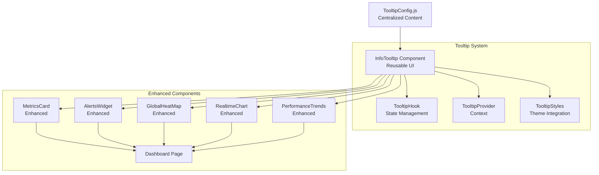

# Design Document

## Overview

The dashboard tooltips enhancement will add contextual help information to the EdgeWorker monitoring dashboard through strategically placed "i" icons with informative tooltips. The design focuses on creating a reusable tooltip system that integrates seamlessly with the existing Material-UI design system and provides valuable context without cluttering the interface.

## Architecture



## Components and Interfaces

### 1. InfoTooltip Component

**Purpose**: Reusable tooltip component with "i" icon trigger
**Location**: `src/components/InfoTooltip.jsx`

```javascript
// Component Interface
<InfoTooltip
  content="Tooltip content or config key"
  placement="top" // top, bottom, left, right
  size="small" // small, medium, large
  variant="icon" // icon, text, custom
  maxWidth={300}
  interactive={false}
  mobile="tap" // tap, hover, disabled
/>
```

**Features**:
- Material-UI Tooltip integration
- Responsive behavior (hover on desktop, tap on mobile)
- Configurable positioning and sizing
- Theme-aware styling
- Accessibility compliant (ARIA labels, keyboard navigation)

### 2. Tooltip Configuration System

**Purpose**: Centralized content management for all tooltips
**Location**: `src/config/tooltipConfig.js`

```javascript
// Configuration Structure
export const tooltipConfig = {
  metrics: {
    totalPops: {
      title: "Total Points of Presence",
      content: "The total number of Akamai edge locations currently monitored...",
      learnMore: "/docs/pops-overview"
    },
    avgColdStart: {
      title: "Average Cold Start Time",
      content: "Mean time for EdgeWorker functions to initialize...",
      calculation: "Calculated from the last 1000 function executions",
      threshold: "Target: <50ms, Warning: >100ms, Critical: >200ms"
    }
    // ... more configurations
  },
  components: {
    heatmap: {
      title: "Global Performance Heat Map",
      content: "Visual representation of EdgeWorker performance...",
      colorCoding: {
        green: "Healthy (0-50ms)",
        yellow: "Warning (50-100ms)", 
        red: "Critical (>100ms)"
      }
    }
    // ... more configurations
  }
}
```

### 3. Enhanced Component Integration

#### MetricsCard Enhancement
```javascript
// Enhanced MetricsCard with tooltip
<MetricsCard
  title="Total PoPs"
  value={overview?.totalPops || 0}
  icon={<Language />}
  color="primary"
  tooltip="metrics.totalPops" // References config key
  change="+2 this week"
  trend="up"
/>
```

#### Dashboard Cards with Tooltips
```javascript
// Card header with integrated tooltip
<Box display="flex" alignItems="center" justifyContent="between">
  <Typography variant="h6">Global Performance Heat Map</Typography>
  <InfoTooltip content="components.heatmap" placement="left" />
</Box>
```

## Data Models

### Tooltip Content Model
```typescript
interface TooltipContent {
  title: string;
  content: string;
  calculation?: string;
  threshold?: string;
  learnMore?: string;
  colorCoding?: Record<string, string>;
  actions?: Array<{
    label: string;
    url: string;
    type: 'internal' | 'external';
  }>;
}
```

### Component Props Model
```typescript
interface InfoTooltipProps {
  content: string | TooltipContent;
  placement?: 'top' | 'bottom' | 'left' | 'right';
  size?: 'small' | 'medium' | 'large';
  variant?: 'icon' | 'text' | 'custom';
  maxWidth?: number;
  interactive?: boolean;
  mobile?: 'tap' | 'hover' | 'disabled';
  children?: React.ReactNode;
}
```

## Error Handling

### 1. Missing Configuration
- **Detection**: Check if tooltip config key exists
- **Fallback**: Display generic "Information not available" message
- **Logging**: Log missing configuration keys for development

### 2. Content Loading Failures
- **Detection**: Try-catch around content rendering
- **Fallback**: Show simplified tooltip with basic information
- **Recovery**: Retry loading configuration on next interaction

### 3. Mobile Touch Conflicts
- **Detection**: Monitor touch events and tooltip state
- **Prevention**: Implement proper event handling to prevent conflicts
- **Fallback**: Disable tooltips on problematic mobile browsers

## Testing Strategy

### 1. Component Testing
- **InfoTooltip Rendering**: Test all variants and placements
- **Configuration Loading**: Verify content loads from config correctly
- **Accessibility**: Test keyboard navigation and screen reader compatibility
- **Responsive Behavior**: Test hover vs tap behavior on different devices

### 2. Integration Testing
- **Dashboard Integration**: Verify tooltips work on all dashboard components
- **Theme Compatibility**: Test with light/dark themes
- **Performance Impact**: Measure rendering performance with tooltips enabled
- **Cross-browser Testing**: Verify functionality across major browsers

### 3. User Experience Testing
- **Tooltip Positioning**: Ensure tooltips don't overflow viewport
- **Content Readability**: Verify text is readable at all sizes
- **Interaction Flow**: Test tooltip doesn't interfere with normal interactions
- **Mobile Usability**: Verify touch interactions work smoothly

## Implementation Details

### 1. Tooltip Positioning Logic
```javascript
// Smart positioning to avoid viewport overflow
const getOptimalPlacement = (triggerElement, preferredPlacement) => {
  const rect = triggerElement.getBoundingClientRect();
  const viewport = { width: window.innerWidth, height: window.innerHeight };
  
  // Calculate available space in each direction
  const space = {
    top: rect.top,
    bottom: viewport.height - rect.bottom,
    left: rect.left,
    right: viewport.width - rect.right
  };
  
  // Return placement with most available space
  return Object.keys(space).reduce((a, b) => space[a] > space[b] ? a : b);
};
```

### 2. Mobile Touch Handling
```javascript
// Enhanced touch handling for mobile devices
const handleMobileInteraction = (event) => {
  if (isMobile) {
    event.preventDefault();
    setTooltipOpen(prev => !prev);
    
    // Auto-close after 5 seconds
    setTimeout(() => setTooltipOpen(false), 5000);
  }
};
```

### 3. Theme Integration
```javascript
// Tooltip styling that adapts to theme
const tooltipStyles = (theme) => ({
  tooltip: {
    backgroundColor: theme.palette.mode === 'dark' 
      ? 'rgba(0, 0, 0, 0.9)' 
      : 'rgba(255, 255, 255, 0.95)',
    color: theme.palette.text.primary,
    backdropFilter: 'blur(10px)',
    border: `1px solid ${theme.palette.divider}`,
    borderRadius: theme.shape.borderRadius,
    fontSize: theme.typography.body2.fontSize,
    maxWidth: 320,
    padding: theme.spacing(1.5)
  }
});
```

## Accessibility Considerations

### 1. ARIA Compliance
- **aria-describedby**: Link tooltip content to trigger element
- **role="tooltip"**: Proper semantic role for screen readers
- **aria-hidden**: Hide decorative "i" icons from screen readers

### 2. Keyboard Navigation
- **Tab Order**: Include tooltip triggers in natural tab sequence
- **Enter/Space**: Activate tooltips with keyboard
- **Escape**: Close open tooltips

### 3. Screen Reader Support
- **Alternative Text**: Provide meaningful descriptions for icon triggers
- **Content Structure**: Use proper heading hierarchy in tooltip content
- **Focus Management**: Maintain logical focus flow

## Performance Optimization

### 1. Lazy Loading
- Load tooltip configurations only when needed
- Implement virtual scrolling for long tooltip lists
- Cache frequently accessed tooltip content

### 2. Rendering Optimization
- Use React.memo for InfoTooltip component
- Implement proper dependency arrays for useEffect hooks
- Minimize re-renders with stable references

### 3. Bundle Size Management
- Tree-shake unused tooltip configurations
- Implement code splitting for tooltip content
- Optimize icon assets and reduce bundle impact