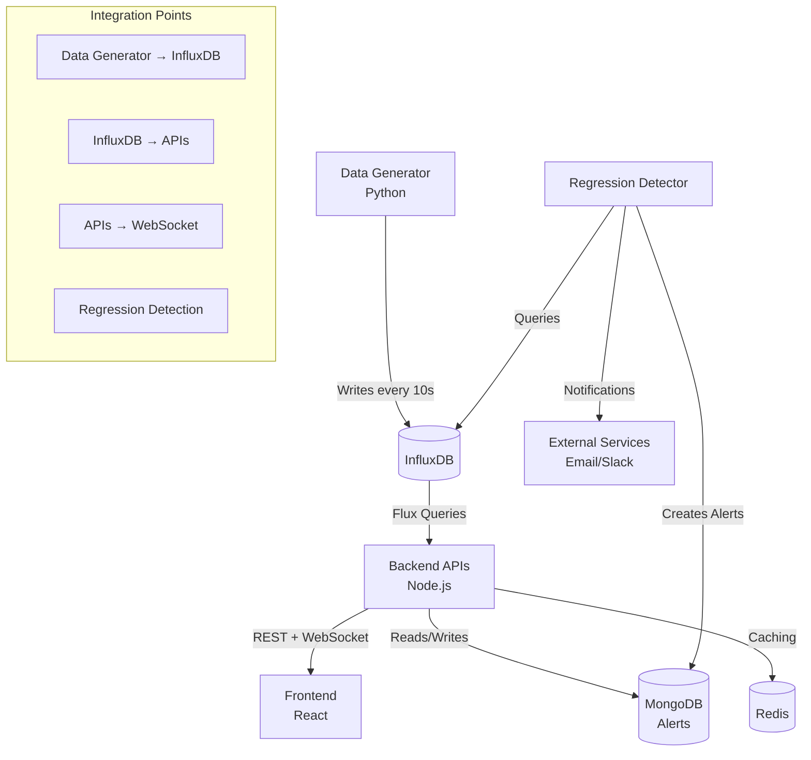

# Design Document

## Overview

The EdgeWorker monitoring system consists of a Python data generator that writes metrics to InfluxDB, a Node.js backend that serves APIs from InfluxDB data, and a React frontend. Analysis reveals several integration gaps that prevent real-time data flow:

1. **Timing Misalignment**: Generator writes every 10 seconds, but WebSocket broadcasts every 5 seconds, potentially missing fresh data
2. **Query Optimization Issues**: Some Flux queries may be inefficient or incorrect, causing delays or failures
3. **Error Handling Gaps**: Limited error recovery and logging for InfluxDB connectivity issues
4. **Missing Regression Detection Integration**: RegressionDetector service exists but may not be properly started or integrated
5. **Data Consistency Issues**: Potential field name mismatches between generator and API queries

## Architecture



## Components and Interfaces

### 1. Data Generator Enhancements

**Current State**: Generates metrics every 10 seconds with proper InfluxDB integration
**Issues Identified**:
- No validation of successful writes
- Limited error recovery
- No health check endpoint

**Proposed Changes**:
- Add write confirmation logging
- Implement exponential backoff for failed writes
- Add health check endpoint for monitoring

### 2. InfluxDB Query Optimization

**Current State**: APIs use Flux queries but some may be inefficient
**Issues Identified**:
- Complex multi-yield queries in dashboard overview
- Potential field name mismatches
- Missing query timeouts

**Proposed Changes**:
- Simplify Flux queries for better performance
- Add query timeouts and error handling
- Standardize field names across generator and queries

### 3. WebSocket Broadcasting Improvements

**Current State**: Broadcasts every 5 seconds with InfluxDB queries
**Issues Identified**:
- Broadcasting faster than data generation (5s vs 10s)
- No client connection management
- Limited error handling

**Proposed Changes**:
- Align broadcast interval with data generation
- Add connection state management
- Implement graceful error recovery

### 4. Regression Detection Integration

**Current State**: Service exists but may not be properly initialized
**Issues Identified**:
- Typo in cron schedule (`ture` instead of `true`)
- Service may not be started in main app
- Limited integration with real-time alerts

**Proposed Changes**:
- Fix cron scheduling bug
- Ensure service starts with application
- Integrate with WebSocket for real-time alert notifications

## Data Models

### InfluxDB Schema (Generated by Python)
```
Measurement: cold_start_metrics
Tags:
- pop_code: string
- city: string  
- country: string
- tier: string
- function_name: string

Fields:
- cold_start_time_ms: float
- latitude: float
- longitude: float

Timestamp: nanosecond precision
```

### API Response Models
```javascript
// Dashboard Overview
{
  totalPops: number,
  healthyPops: number,
  averageColdStart: number,
  regressions: number
}

// Heatmap Data
[{
  popCode: string,
  city: string,
  country: string,
  lat: number,
  lon: number,
  coldStartTime: number,
  status: 'healthy' | 'warning' | 'critical'
}]

// WebSocket Message
{
  type: 'metrics_update',
  data: {
    totalPops: number,
    averageColdStart: number,
    healthyPops: number,
    regressions: number
  }
}
```

## Error Handling

### 1. InfluxDB Connection Failures
- **Detection**: Health check API calls and query timeouts
- **Recovery**: Exponential backoff reconnection with circuit breaker pattern
- **Fallback**: Return cached data from Redis when available
- **Logging**: Structured error logs with connection state details

### 2. Query Execution Failures
- **Detection**: Flux query exceptions and empty result sets
- **Recovery**: Retry with simplified queries, fallback to cached data
- **Fallback**: Return default/mock data with appropriate status codes
- **Logging**: Query execution time and error details

### 3. WebSocket Broadcasting Failures
- **Detection**: Client connection errors and broadcast exceptions
- **Recovery**: Skip failed clients, continue broadcasting to healthy connections
- **Fallback**: Clients can fall back to polling REST APIs
- **Logging**: Connection state changes and broadcast success rates

## Testing Strategy

### 1. Integration Testing
- **InfluxDB Connectivity**: Test connection, reconnection, and query execution
- **Data Flow**: Verify data flows from generator → InfluxDB → APIs → WebSocket
- **Error Scenarios**: Test behavior during InfluxDB downtime, network issues
- **Performance**: Load test with multiple concurrent API requests

### 2. Unit Testing
- **Flux Query Validation**: Test query syntax and expected results
- **Error Handling**: Test all error paths and recovery mechanisms
- **Data Transformation**: Verify API response formatting
- **WebSocket Logic**: Test connection management and broadcasting

### 3. End-to-End Testing
- **Real-time Updates**: Verify dashboard updates when generator writes new data
- **Alert Integration**: Test regression detection and alert creation flow
- **Multi-client**: Test WebSocket broadcasting to multiple connected clients
- **Failover**: Test system behavior during component failures

## Implementation Phases

### Phase 1: Core Integration Fixes
- Fix RegressionDetector cron scheduling bug
- Optimize InfluxDB Flux queries for performance
- Add proper error handling and logging
- Align WebSocket broadcast timing with data generation

### Phase 2: Reliability Improvements  
- Implement connection pooling and retry logic
- Add Redis caching for frequently accessed data
- Enhance error recovery mechanisms
- Add comprehensive monitoring and health checks

### Phase 3: Performance Optimization
- Optimize database queries and indexing
- Implement data aggregation and caching strategies
- Add query result pagination for large datasets
- Optimize WebSocket message frequency and payload size

### Phase 4: Monitoring and Observability
- Add application metrics and dashboards
- Implement distributed tracing for request flows
- Add alerting for system health issues
- Create operational runbooks for common issues